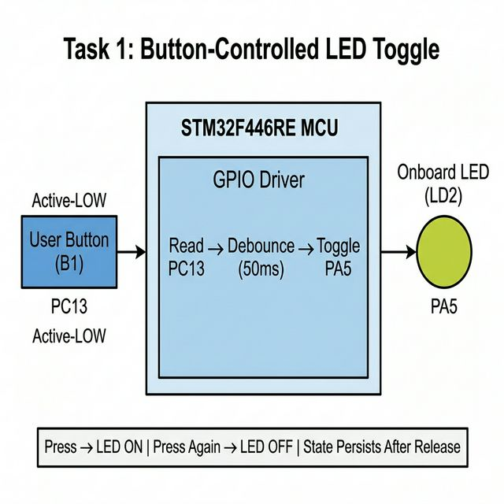
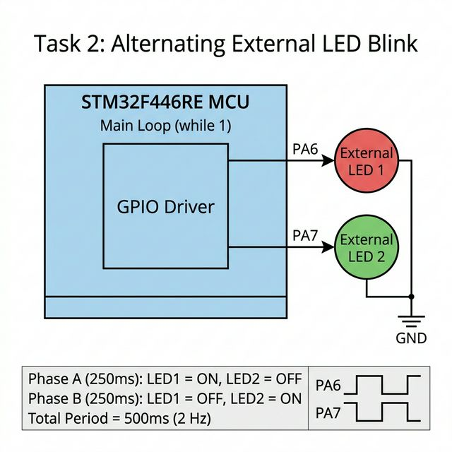

# STM32 GPIO Driver Assignment — PA6 & PA7

## Assignment Objective

Integrate the provided bare-metal GPIO driver with the STM32 Nucleo-F446RE board to complete two tasks using **only the driver's API** — no direct register access in application code.

| Task       | Requirement                                                              |
| ---------- | ------------------------------------------------------------------------ |
| **Task 1** | Button-controlled LED toggle (onboard button B1 → onboard LED LD2)       |
| **Task 2** | Alternating external LED blink on PA6 & PA7 (250 ms ON each, continuous) |

---

## Board & Toolchain

| Item            | Detail                            |
| --------------- | --------------------------------- |
| **Target Board**| NUCLEO-F446RE (STM32F446RE)       |
| **IDE**         | STM32CubeIDE                      |
| **Clock**       | 16 MHz      |
| **Language**    | Embedded C (bare-metal, no HAL)   |

---

## Pin Mapping

| Pin  | Direction | Function            | Why This Pin?                                                    |
| ---- | --------- | ------------------- | ---------------------------------------------------------------- |
| PA5  | OUTPUT    | Onboard LED (LD2)   | Directly connected to LD2 on all Nucleo-64 boards                |
| PA6  | OUTPUT    | External LED 1      | Available on CN10 Morpho header, no conflict with onboard pins   |
| PA7  | OUTPUT    | External LED 2      | Adjacent to PA6 on CN10, convenient for breadboard wiring        |
| PC13 | INPUT     | User Button (B1)    | Hardwired to the blue push-button on all Nucleo boards (active-LOW) |

---

## Task 1 — Button-Controlled LED

### Block Diagram



### How It Works

- **B1 (PC13)** is active-LOW: reads `0` when pressed, `1` when released.
- On a confirmed press, **LD2 (PA5)** is toggled — ON → OFF or OFF → ON.
- LED state **persists** after the button is released.
- Software debounce (50 ms wait + re-read) eliminates flickering from mechanical bounce.
- Firmware waits for button release before returning → **one press = one toggle**.

---

## Task 2 — Alternating External LED Blink

### Block Diagram



### Wiring Steps

1. Connect **PA6** (CN10 pin 13) → **anode (long leg)** of LED 1.
2. Connect **cathode (short leg)** of LED 1 → **GND** rail.
3. Connect **PA7** (CN10 pin 15) → **anode (long leg)** of LED 2.
4. Connect **cathode (short leg)** of LED 2 → **GND** rail.

### Blink Pattern

| Phase   | PA6 (LED 1) | PA7 (LED 2) | Duration |
| ------- | ----------- | ----------- | -------- |
| Phase A | ON          | OFF         | 250 ms   |
| Phase B | OFF         | ON          | 250 ms   |

- Total blink cycle = **500 ms** (2 Hz)
- LEDs blink **out of phase** — smooth alternating pattern

---

## Super-Loop Integration

Both tasks are integrated into a single `while(1)` super-loop in `main.c`:

```c
int main(void)
{
    setup_pins();          // init all GPIOs (PA5, PA6, PA7, PC13)

    while (1)
    {
        handle_button();   // Task 1: check button, debounce, toggle PA5
        alternate_leds();  // Task 2: PA6/PA7 alternating blink (~500ms)
    }
}
```

- `handle_button()` returns immediately if button is not pressed → no delay overhead.
- `alternate_leds()` blocks for ~500 ms total (250 ms × 2 phases).
- Both tasks share the loop without conflicting.

---

## Project File Structure

```
STM32_GPIO_Driver_Assignment_PA6_PA7/
├── Inc/
│   ├── gpio_driver.h    ← GPIO driver header (base addresses, config struct, API prototypes)
│   └── delay.h          ← Delay utility header
└── Src/
    ├── main.c           ← Application: setup_pins + handle_button (Task 1) + alternate_leds (Task 2)
    ├── gpio_driver.c    ← GPIO driver: GPIO_Init, GPIO_WritePin, GPIO_ReadPin, GPIO_TogglePin
    └── delay.c          ← Busy-wait delay (calibrated for 16 MHz HSI, no timers)
```

---

## GPIO Driver API Summary

| Function           | What It Does                                              | Register Used              |
| ------------------ | --------------------------------------------------------- | -------------------------- |
| `GPIO_Init()`      | Enables AHB1 clock for the port; sets pin mode in MODER   | RCC_AHB1ENR, GPIOx_MODER  |
| `GPIO_WritePin()`  | Atomically sets or resets a single pin                     | GPIOx_BSRR                 |
| `GPIO_ReadPin()`   | Returns 0 or 1 for the current logic level of a pin       | GPIOx_IDR                  |
| `GPIO_TogglePin()` | Flips the output state of a pin using XOR                  | GPIOx_ODR                  |

> **No direct register access in `main.c`** — all GPIO operations go through these four driver functions.

---

## Build & Flash

1. Open **STM32CubeIDE**.
2. *File → Open Projects from File System → Directory →* select this folder.
3. Build: *Project → Build All* (`Ctrl+B`) → **0 errors, 0 warnings**.
4. Flash: *Run → Debug As → STM32 C/C++ Application*.
5. Press **RESET** on the board if needed.

---

## Observations (Tested on NUCLEO-F446RE)

### Task 1 — Button Toggle

- Pressing **B1** toggles **LD2** reliably — **no flickering**.
- LED state **holds** after release (persists as required).
- Holding the button does NOT cause repeated toggling.
- Single press = exactly one toggle.

### Task 2 — Alternating Blink

- LED 1 (PA6) and LED 2 (PA7) blink in a **clear out-of-phase alternating pattern**.
- Each LED stays ON for ~250 ms → visually smooth chase effect.
- Blinking runs continuously without interrupting button detection.


